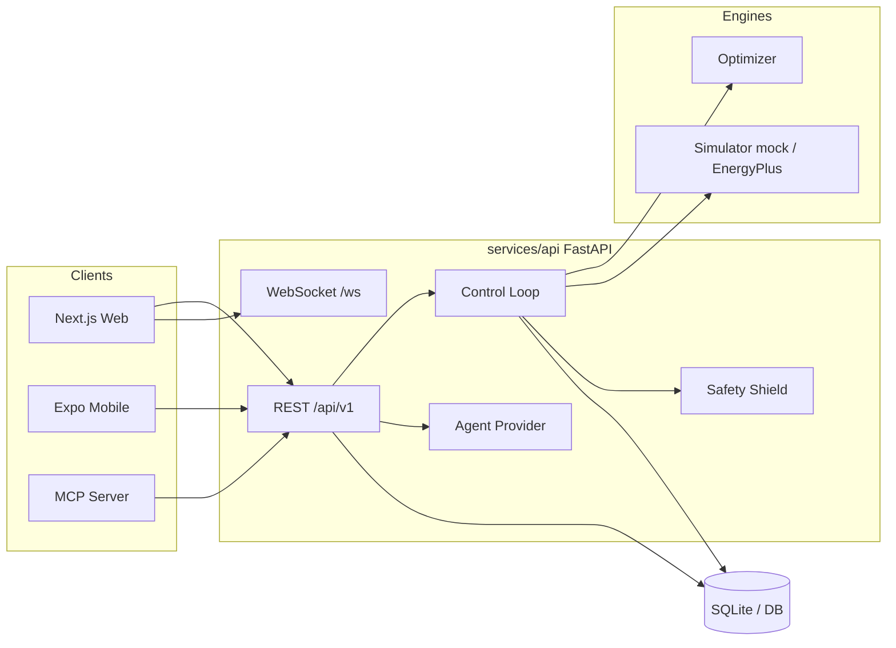

# TwinPilot

**Verifiable Autonomous Building Optimization**

> Autonomous optimization you can verify.

TwinPilot is a **multi-tenant B2B platform** for **safe, explainable building control**: a digital twin + optimizer proposes actions, an independent **Safety Shield** validates them, and operators can approve, override, or roll back — with a prediction ledger so claims stay auditable.

This repository ships:

- A working **simulated** demo (mock twin by default)
- **Production SaaS foundation** — orgs, RBAC, Stripe entitlements, Postgres/Redis workers
- **Vendor-agnostic BMS connectors** — BACnet/IP, Modbus TCP, and a **Honeywell Niagara/Forge** certified adapter path
- Site onboarding: connect → map points → shadow → guarded pilot → certified autonomy

See [docs/PRODUCTION_PLATFORM.md](docs/PRODUCTION_PLATFORM.md). EnergyPlus and Ollama remain optional. Unsupervised Autonomous write on uncertified live sites is intentionally blocked.

---

## Architecture



See [docs/ARCHITECTURE.md](docs/ARCHITECTURE.md) for control loop, safety, MCP, deployment, and data-model diagrams.

---

## Features

- **Operating modes**: AUTONOMOUS · GUARDED · ADVISORY · FALLBACK · MANUAL
- **Multi-objective optimization** (energy, cost, carbon, comfort, peak, equipment)
- **Independent Safety Shield** — constraints, rate limits, confidence, validation tokens
- **Prediction ledger** — predicted vs realized outcomes
- **Demo scenarios** — hot day, occupancy spike, carbon intensity, faulty sensor, infeasible target, simulation failure, rollback
- **Operator web UI** — dashboard, zones, decisions, alerts, digital twin, analytics, assistant, audit
- **Mobile (Expo)** — approvals, alerts, rollback, offline banner
- **MCP server** — read-only resources + narrowly scoped tools (no unrestricted actuation)
- **Optional EnergyPlus adapter** with graceful mock fallback
- **Optional Ollama** for richer assistant explanations (deterministic provider by default)

---

## Tech stack

| Layer | Stack |
|-------|--------|
| API | FastAPI, SQLAlchemy, Alembic, JWT, Pydantic Settings |
| Optimizer / Safety | `twinpilot-optimizer` (pure Python) |
| Simulator | Mock twin (default) · EnergyPlus adapter (optional) |
| Agent | Deterministic (default) · Ollama (optional) |
| Web | Next.js 15, React 19, TanStack Query, Tailwind, Zod |
| Mobile | Expo 52, Expo Router |
| MCP | `twinpilot-mcp` (stdio / FastMCP) |
| Monorepo | pnpm workspaces + Turborepo |

---

## Repository structure

```
apps/web                 Next.js operator console
apps/mobile              Expo mobile app
services/api             FastAPI backend + control loop
services/optimizer       Planner, objectives, Safety Shield
services/simulator       Mock + EnergyPlus adapter
services/agent           Deterministic / Ollama providers
services/mcp-server      MCP tools & resources
packages/*               Shared contracts, api-client, config, tokens
building-models/         Sample IDF / weather placeholders
infrastructure/          Dockerfiles + setup/demo scripts
docs/                    Architecture, API, safety, demo script
tests/integration        Cross-service API flow tests
```

---

## Prerequisites

- **Python 3.11+** (3.12 recommended)
- **Node.js 22** (see `.nvmrc`) + **pnpm 10**
- Optional: Docker / Docker Compose
- Optional: EnergyPlus + Python bindings
- Optional: Ollama (`llama3.2` or compatible)

---

## Quick start

```bash
make setup    # venv, editable Python packages, pnpm install, .env
make replay   # headless end-to-end scenario walkthrough (starts API if needed)
make demo     # API :8000 + Web :3000
```

Open **http://localhost:3000** and log in with a demo account below.

`make replay` exercises: login → hot-day scenario → plan simulate/approve/apply →
sensor-fault (Guarded) → infeasible target → assistant → rollback → ledger/audit.

Optional open-source LLM (not required — deterministic agent is default):

```bash
make ollama                 # install Ollama + pull llama3.2:1b
# then in .env: AGENT_PROVIDER=ollama
make demo
```

Alternative:

```bash
make api      # FastAPI only
make web      # Next.js only
make mobile   # Expo
```

Docker (demo profile — SQLite, no Redis):

```bash
docker compose --profile demo up --build
```

---

## Demo credentials (development only)

| Role | Email | Password |
|------|-------|----------|
| Administrator | `admin@twinpilot.demo` | `TwinPilot-Admin-Demo!` |
| Facility Manager | `manager@twinpilot.demo` | `TwinPilot-Manager-Demo!` |
| Operator | `operator@twinpilot.demo` | `TwinPilot-Operator-Demo!` |
| Viewer | `viewer@twinpilot.demo` | `TwinPilot-Viewer-Demo!` |

Seeded building: **TwinPilot Demo Office** (Bengaluru, simulated).

---

## Environment variables

Copy [`.env.example`](.env.example) to `.env`. Key variables:

| Variable | Default | Notes |
|----------|---------|--------|
| `DEMO_MODE` | `true` | Enables demo UX / relaxed ingest |
| `DATABASE_URL` | `sqlite:///./twinpilot.db` | No Redis required for demo |
| `SIMULATOR_PROVIDER` | `mock` | Or `energyplus` |
| `AGENT_PROVIDER` | `deterministic` | Or `ollama` |
| `JWT_SECRET` / `JWT_REFRESH_SECRET` | dev secrets | Change outside demo |
| `NEXT_PUBLIC_API_URL` | `http://localhost:8000` | Web |
| `EXPO_PUBLIC_API_URL` | `http://localhost:8000` | Mobile |
| `ENERGYPLUS_*` | unset | Optional; see [docs/ENERGYPLUS.md](docs/ENERGYPLUS.md) |
| `OLLAMA_BASE_URL` / `OLLAMA_MODEL` | localhost / `llama3.2` | Optional |

Full list: [`.env.example`](.env.example).

---

## Running components

### Backend (API)

```bash
make api
# http://localhost:8000/docs  ·  /health  ·  /ready
```

Control loop runs in-process when `CONTROL_LOOP_ENABLED=true`.

### Web

```bash
make web
# http://localhost:3000
```

### Mobile

```bash
make mobile
# Set EXPO_PUBLIC_API_URL to your machine IP for a physical device
```

### Mock simulator (default)

Default `SIMULATOR_PROVIDER=mock` — deterministic twin with playback speed, scenarios, and what-if controls via `/api/v1/demo/*`.

### EnergyPlus (optional)

```bash
export SIMULATOR_PROVIDER=energyplus
export ENERGYPLUS_HOME=...
export ENERGYPLUS_MODEL_PATH=...
export ENERGYPLUS_WEATHER_PATH=...
make energyplus-check
make api
```

If EnergyPlus is missing, the adapter **falls back to mock**. See [docs/ENERGYPLUS.md](docs/ENERGYPLUS.md).

### MCP server

```bash
cd services/mcp-server && pip install -e .
export TWINPILOT_API_URL=http://localhost:8000
python -m twinpilot_mcp
```

Details: [docs/MCP.md](docs/MCP.md).

### Ollama (optional)

```bash
ollama pull llama3.2
export AGENT_PROVIDER=ollama
export OLLAMA_BASE_URL=http://localhost:11434
make api
```

Without Ollama, keep `AGENT_PROVIDER=deterministic`.

---

## Tests

```bash
make test                 # API pytest + web typecheck/lint (+ integration)
cd services/api && pytest # Safety / objective unit tests
```

See [docs/TESTING.md](docs/TESTING.md).

---

## Demo scenarios

Via UI (Simulator page) or API:

| ID | Description |
|----|-------------|
| `normal_hot_day` | Baseline hot-day optimization |
| `occupancy_spike` | Unexpected occupancy |
| `carbon_intensive` | High grid carbon intensity |
| `faulty_sensor` | Sensor failure → confidence / mode impact |
| `infeasible_target` | Aggressive target rejected as infeasible |
| `simulation_failure` | Simulator failure path |
| `rollback` | Safe-policy rollback |

Guided walkthrough: [docs/DEMO_SCRIPT.md](docs/DEMO_SCRIPT.md) (~7 minutes).

---

## Known limitations (honest)

- **Simulated demo** — KPIs and savings are labeled simulated; not verified real-building savings.
- **No production BMS / Honeywell / BACnet connectors** in this repo.
- **EnergyPlus** optional; adapter falls back to mock when bindings/paths are unavailable; full co-simulation is environment-specific.
- **Ollama** optional; assistant works with the deterministic provider.
- **SQLite** default — fine for demo; Postgres optional via Compose `full` profile.
- **Not production-certified** — security hardening, HA, and site commissioning are out of scope.

---

## Documentation

| Doc | Topic |
|-----|--------|
| [docs/ARCHITECTURE.md](docs/ARCHITECTURE.md) | System design & diagrams |
| [docs/API.md](docs/API.md) | REST + WebSocket reference |
| [docs/SAFETY.md](docs/SAFETY.md) | Safety Shield & modes |
| [docs/ENERGYPLUS.md](docs/ENERGYPLUS.md) | Optional EnergyPlus |
| [docs/DEMO_SCRIPT.md](docs/DEMO_SCRIPT.md) | 7-minute demo |
| [docs/TESTING.md](docs/TESTING.md) | Test strategy |
| [docs/DEPLOYMENT.md](docs/DEPLOYMENT.md) | Local / Docker deploy |
| [docs/BUILD_STATUS.md](docs/BUILD_STATUS.md) | Phase checklist |
| [docs/MCP.md](docs/MCP.md) | MCP resources & tools |

---

## License / status

Internal demo / research prototype. **Not for controlling live buildings without qualified engineering review.**
