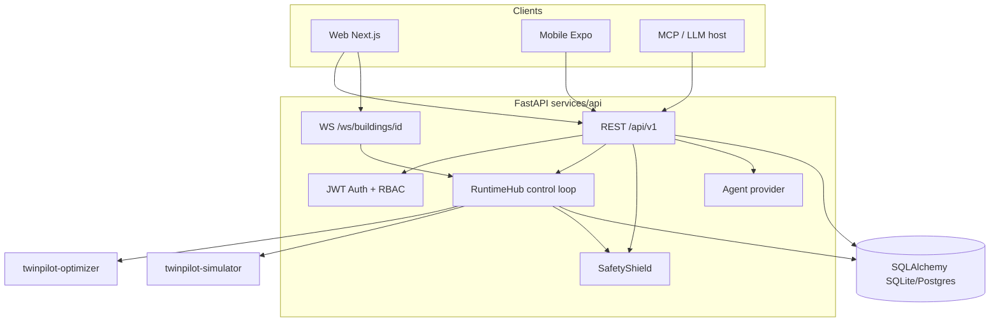
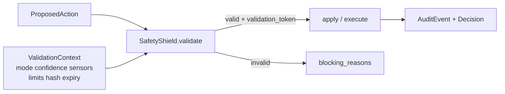
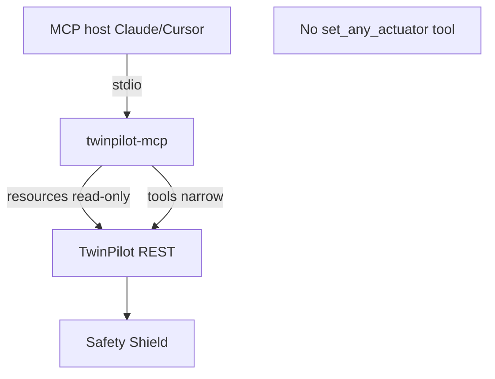
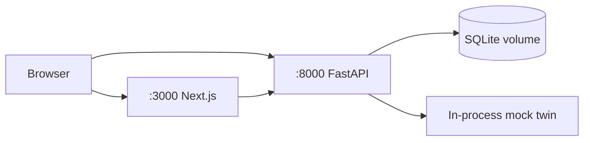
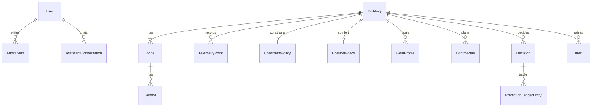

# TwinPilot Architecture

TwinPilot separates **proposal** (optimizer / agent), **validation** (Safety Shield), and **actuation** (simulator apply / override). The API hosts an in-process control loop that steps the twin, generates plans, validates, and optionally applies them based on operating mode.

**Scope note:** This demo uses a **mock building simulator** by default. There is no production Honeywell/BMS integration in this repository.

---

## System overview



---

## Control loop

```mermaid
sequenceDiagram
  participant Loop as Control loop
  participant Sim as Simulator
  participant Opt as Optimizer
  participant Shield as Safety Shield
  participant DB as Database
  participant WS as WebSocket clients

  loop every CONTROL_INTERVAL_SECONDS
    Loop->>Sim: step / get_state
    Loop->>Opt: generate_candidate_plans
    Loop->>Shield: validate selected action
    alt mode AUTONOMOUS/GUARDED and valid
      Loop->>Sim: apply_action
      Loop->>DB: Decision + ledger entry
    else ADVISORY / needs approval / invalid
      Loop->>DB: Decision PENDING or rejected
    end
    Loop->>WS: telemetry.updated / decision.created / ...
  end
```

Modes are managed by `twinpilot_optimizer.modes` (deterministic thresholds). Critical faults force **FALLBACK**; operators can force **MANUAL**.

---

## Safety architecture



Rules include setpoint ranges, max Δ per interval, duration caps, data freshness, sensor health, simulation OK, plan expiry, state-hash match, and mode-gated approval. See [SAFETY.md](SAFETY.md).

The Safety Shield lives in `services/optimizer` and is imported by the API — **not** by the LLM agent path for final authorization.

---

## MCP architecture



Resources load context; mutating tools require validation tokens / RBAC-backed API calls. See [MCP.md](MCP.md).

---

## Deployment (demo)



Compose profiles:

| Profile | Services |
|---------|----------|
| `demo` | `api` + `web` (SQLite, no Redis) |
| `full` | `api` + `web` + optional `postgres` |
| `energyplus` | `api` + `web` with EnergyPlus env/mounts |

Details: [DEPLOYMENT.md](DEPLOYMENT.md).

---

## Data model (core)



Primary entities are defined in `services/api/app/models/entities.py`. Runtime still calls `Base.metadata.create_all` on startup; Alembic is available for future migrations (`services/api/alembic`).

---

## Packages

| Path | Role |
|------|------|
| `packages/contracts` | Shared Zod enums / WS event schemas |
| `packages/api-client` | Thin typed REST stubs |
| `packages/config` | Shared TS config helpers |
| `packages/design-tokens` | Color / type tokens |
| `packages/eslint-config` | Minimal shared ESLint export |
